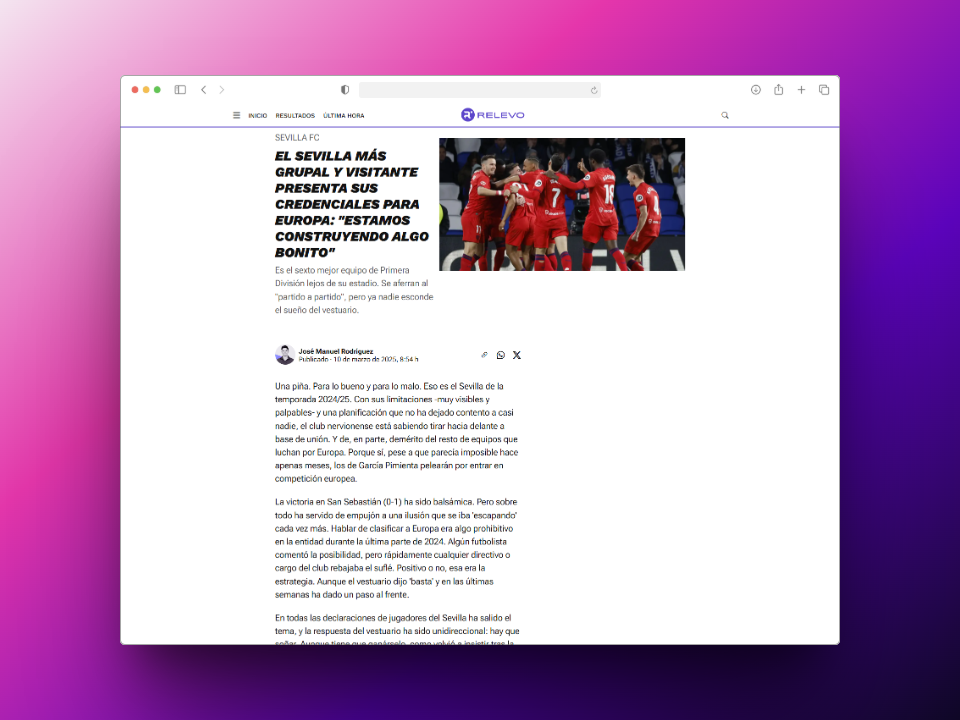
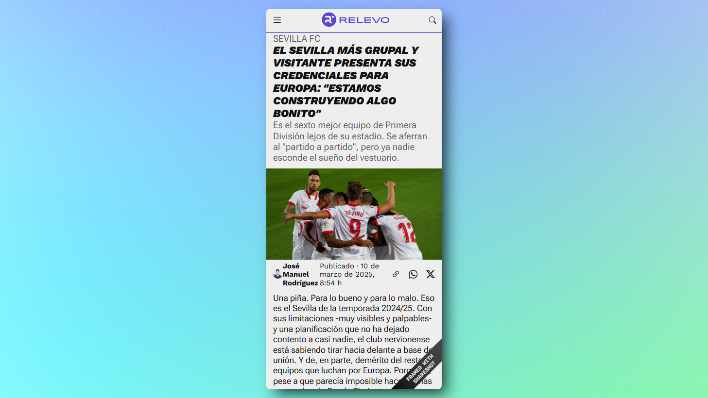

# 📰 Clon de la web de Relevo

Este proyecto es un clon de una noticia extraida del medio deportivo español **Relevo**, desarrollado como parte del bootcamp de desarrollo web. El objetivo principal era poner en práctica los conocimientos adquiridos sobre **HTML**, **CSS** y diseño **responsive**.


## 🚀 Tecnologías utilizadas

- HTML5
- CSS3 (Flexbox)
- Responsive Design (media queries)


## 📦 Instalación

No es necesario instalar nada para visualizar este proyecto.  
Solo necesitas clonar el repositorio y abrir el archivo `index.html` en tu navegador:

```bash
git clone https://github.com/davidrguez98/Neoland-Proyecto-Noticia
```


## 📸 Capturas de pantalla

  



## 🎯 Objetivo del proyecto

- Replicar la estructura de una web real utilizando HTML y CSS puro.
- Practicar diseño responsive para adaptar la página a diferentes dispositivos.
- Aplicar buenas prácticas en la maquetación y organización del código.


## 📚 Aprendizajes

- Mejora en el uso de **Flexbox**.
- Dominio básico de **media queries** para diseño responsive.
- Estructuración limpia y ordenada de archivos HTML y CSS.


## 📁 Estructura del proyecto

```bash
├── assets
│   ├── screenshots
│   │   ├── IMG_6196.png
│   │   └── IMG_6197.png
│   ├── main-image.png
│   └── rueda-de-prensa.mp4
├── style
│   ├── reset.css
│   ├── root.css
│   └── style.css
├── index.html
└── README.md
```


## 📌 Notas

Este proyecto forma parte del bootcamp de desarrollo web y está enfocado únicamente en la maquetación.  
No incluye funcionalidades JavaScript ni contenido dinámico.
